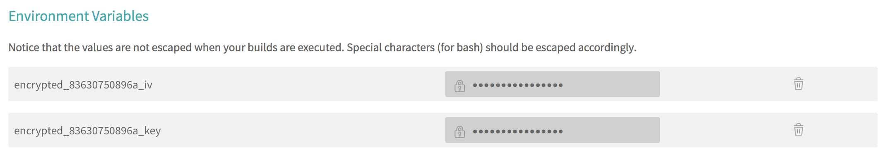

# Travis Deployment [](http://spacemacs.org)

## Setup
* To deploy your project to custom server using Travis we need to have installed travis cli tool ```gem install travis```, or you can use [Docker image](https://github.com/MilosSimic/mytravis).
* Before using this tool, positionate in directory where ```.travis.yml``` file is.
* To encrypt your secrets use ```encrypt```command:
```
travis  encrypt DOCKER_HUB_EMAIL=<email> --add
travis  encrypt DOCKER_HUB_USERNAME=<username> --add
travis  encrypt DOCKER_HUB_PASSWORD=<password> --add
``` 
**Note: these secrets will be stored as environment variables, and we can use them during our build process** (eg. ```$DOCKER_HUB_EMAIL```) **in your** ```.travis.yml``` **file. For more details see [docs](https://docs.travis-ci.com/user/encryption-keys/)**

**NOTE: ```travis``` is cli command of travis tool. If you use docker image you can't run that with travis! Refer to [image README](https://github.com/MilosSimic/mytravis) how to use docker image**

## Build Docker image and push to dockerhub
* To pack our application in docker image, first create ```Dockerfile``` in your project structure with all commands needed for your application.
* Then we need to add few things to ```.travis.yml``` :
```
sudo: required
language: python
services:
 - docker
before_install:
  - docker login -u "$DOCKER_HUB_USERNAME" -p "$DOCKER_HUB_PASSWORD";
after_success:
  - docker build -t $DOCKER_HUB_USERNAME/image_name .
  - docker push $DOCKER_HUB_USERNAME/image_name:your_tag
```

**Note: here we are missing steps for running tests, install dependencies explained [elsewhere](CI.md)**

* Create a deploy script, which will be called after Travis finish his work. We will use [Docker Compose](https://docs.docker.com/compose/) create ```docker-compose.yml``` file and add this content:
```
version: '2'
services:
 app:
   image: <your_docker_hub_id>/<your_project_name>:production
   ports: 
     - server_port:container_port
```

**Note, we can create** ```docker-compose.yml``` **file on server, or create localy than copy to server using** ```scp docker-compose.yml host@address:```**

* And we need a little bit of bash :). Create a ```deploy.sh``` file with the following content (locally than copy to server, or create on server direcly):
```
docker-compose down
docker-compose pull
docker-compose up -d
```

* Make the file executable (and send it to your host if created localy using ```scp``` command):
```
chmod +x ./deploy.sh
```

## Security
We need more security so when Travis finish his job to send command to your host machine. So we need some keys to to that.

* Create the deploy key on your machine (leave passphrase empty, press Enter when asking for passphrase):
```
ssh-keygen -f deploy_key
```

_See [docs](https://help.github.com/articles/generating-a-new-ssh-key-and-adding-it-to-the-ssh-agent/#platform-mac) about ssh-keygen for Linux, Windows and Mac_

* Copy the output of the following command:
```
echo "command=./deploy.sh",no-port-forwarding,no-agent-forwarding,no-pty $(cat ./deploy_key.pub)
```

* Connect to your host and paste output to the .ssh/authorized_keys. You'll end up with a command similar to this:
```
echo 'command="./deploy.sh",no-port-forwarding,no-agent-forwarding,no-pty ssh-rsa AAAAB3NzaC1yc2EAAAADAQABAAABAQC/OAw[...]kQ728t3jxPPiFX** >> ~/.ssh/authorized_keys
```

**Note:This will make sure the only command allowed for the user connecting with the deploy key is our deployment script.***

* Encrypt the deployment key (you DO NOT want unencrypted private key in your repository):
```
travis encrypt-file  ./deploy_key --add
```

**Note: ```--add ``` option will add the decryption command in your travis file**

* Update ```before_install``` so that Travis is able to extrct key from encrypted key:
```
before_install:
  - docker login -u "$DOCKER_HUB_USERNAME" -p "$DOCKER_HUB_PASSWORD";
  - openssl aes-256-cbc -K $encrypted_83630750896a_key -iv $encrypted_83630750896a_iv -in deploy_key.enc -out ./deploy_key -d
```

**Note: ```openssl``` command will be shown as output after successful key encryption. Just follow the instructions**

* Add it to the project:
```
git add deploy_key.enc
git commit -m ...
git push
```

After this command you can check environment variables of your project to see is it stored. Yous hould have something like this:




## Automatic deployment
Here will be shown how to deploy new software version as new docker image

* Finally, add the following section to your ```.travis.yml ```file:
```
deploy:
  provider: script
  skip_cleanup: true
  script: chmod 600 deploy_key && sshpass -e ssh -o StrictHostKeyChecking=no -i ./deploy_key
    $HOST@$HOST_IP './deploy.sh'
  on:
    branch: master
```

* Add sshpass addon. This addon will ensure that Travis enter password on ssh call to your remote host:
```
addons:
  apt:
    packages:
    - sshpass
```

* Update after_success to this. new variable SSHPASS will store host password:
```
after_success:
  - docker login -u "$DOCKER_USERNAME" -p "$DOCKER_PASSWORD";
  - docker push $DOCKER_USERNAME/simple_flask_app:latest
  - export SSHPASS=$DEPLOY_PASS
```

* Commit and push your change and that should trigger Travis build and deploy to remote host server.
* It is not good to run deploy every time. So we need to restrict deploy only for changes on master branch. Travis provide some [environmet variables](https://docs.travis-ci.com/user/environment-variables/#Default-Environment-Variables) that we can use to test is push on the master branch. You can see details [here](https://stackoverflow.com/questions/27896816/how-to-check-if-master-branch-pushed-with-a-tag-under-travis)

## More links
1) [Great tutorial](https://www.linux.com/learn/automatically-deploy-build-images-travis) used to crate this one :D.
2) [Auto deploy to Travis](https://florianbrinkmann.com/en/3485/deployment-travis-ci/)
3) [sshpass on travis](https://neemzy.org/articles/deploy-to-your-own-server-through-ssh-with-travis-ci)
4) [Deployment with Travis](https://oncletom.io/2016/travis-ssh-deploy/)
5) [Fist-Docker-app](https://github.com/MilosSimic/First-Docker-app/blob/master/.travis.yml)
